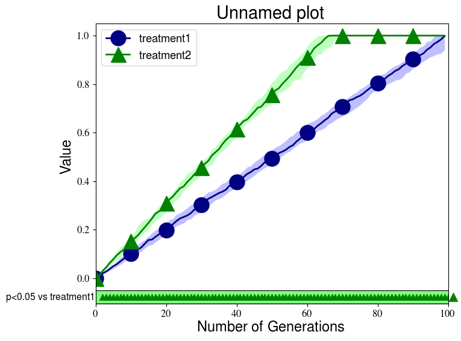

# EA Plotting Scripts
A set of plotting scripts specifically designed to the plot the results of evolutionary algorithm experiments.

# Usage
The entry point for the plotting scripts is createPlots.py. The createPlotUtils.py file holds some usefull helper functions,
but should not be run directly.

### Plot a single file
To plot data from a single file, simply provide the file you wish to plot as an argument to createPlots.py. It is assumed that
your data is organized in columns, with the first column containing the generation number, and the second column containing
the value (e.g. performance) at that generation. You can use options to change this default behavior.

### Plotting directories of files
Besides plotting individual files, createPlots.py can also plot entire directories filled with data files. When plotting a
directory, createPlots.py will assume that each file in that directory holds data you want to plot, and that all files belong
to the same treatment. The script will read all files, calculate the median at each generation across all files, and then plot
that median with its associated interquartile range. If multiple directories are provided, each directory will be considered
as a separate treatment, and thus a different median will be plotted for each directory provided. In addition, the plotting
script will calculate statistical signficance (Mann-Withney U) between the first treatment and the other treatments at each
generation, and it will plot the results of these tests as symbols below the plot.

