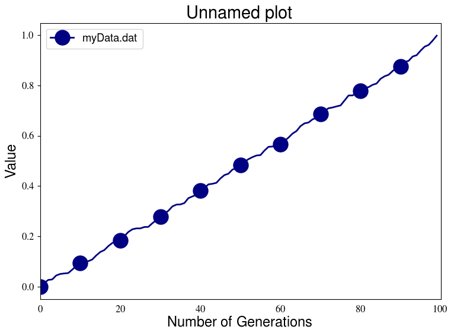
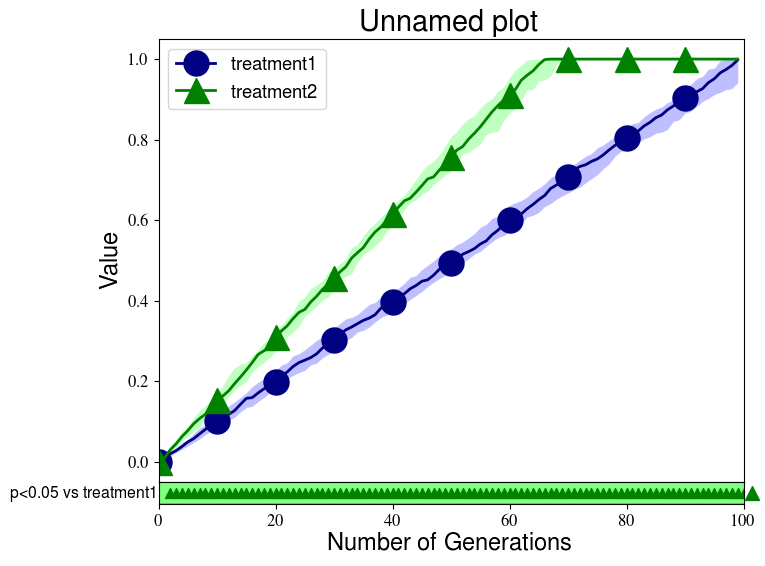
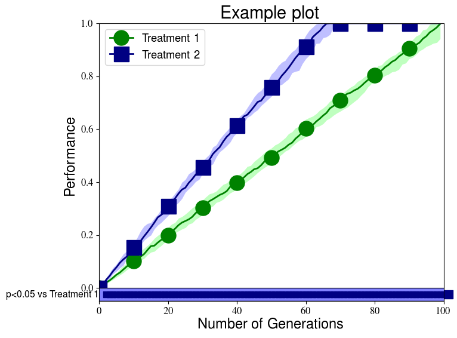

# EA Plotting Scripts
A set of plotting scripts specifically designed to the plot the results of evolutionary algorithm experiments.

# Usage
The entry point for the plotting scripts is createPlots.py. The createPlotUtils.py file holds some usefull helper functions,
but should not be run directly.


### Data format
The createPlots.py requires that the input data has a specific format, and generally does not try to read data
organized in different formats. If your data is in a completely different format, you should probably write a
separate script that reorganizes the data in the appropraite format if you want to use the createPlots.py script
to plot your data.

The createPlots.py script assumes that your data is organized in columns, with each column representing a separate
generation of an evolutionary run. By default, the plot assumes that the first column holds the generation number,
and it will thus start by plotting the second column, but this behavior can be changed by providing the to_plot
option. In addition, the defaults assume that the generations are consecutive. You can change this behavior by
setting the x_from_file and x_column options.

And example of a properly formatted file would be:

```
0 0.2
1 0.4
2 0.6
3 0.8
4 1.0
```

### Plotting a single file
To plot data from a single file, simply provide the file you wish to plot as an argument to createPlots.py.
By default, the script will plot the second column over generations, but the column can be changed by passing the 
to_plot option.

To test this yourself, cd into the examples directory and type:

`createPlots.py myData.dat`

The result should look like this:




### Plotting directories of files
Besides plotting individual files, createPlots.py can also plot entire directories filled with data files. When plotting a
directory, createPlots.py will assume that each file in that directory holds data you want to plot, and that all files belong
to the same treatment. The script will read all files, calculate the median at each generation across all files, and then plot
that median with its associated interquartile range. If multiple directories are provided, each directory will be considered
as a separate treatment, and thus a different median will be plotted for each directory provided. In addition, the plotting
script will calculate statistical signficance (Mann-Withney U) between the first treatment and the other treatments at each
generation, and it will plot the results of these tests as symbols below the plot.


To test this yourself, cd into the examples directory and type:

`createPlots.py treatment1 treatment2`

The result should look like this:




### Plotting from a configuration file
While all plotting script options can be set through the command line, it is often more convenient to use a 
configuration file. This configuration file holds values for all options you want to pass, and can easily be
adjusted whenever you want to make a small change to your plot. An example configuration file would be:

```
#### General ####
templates "file.*.dat"

#### Plots ####
plot_title      "Example plot"
plot_output     "example_plot_3"
plot_column     "1"
plot_y_label    "Performance"
plot_y_min      "0.0"
plot_y_max      "1.0"
plot_legend_loc "upper left"
x_from_file     "True"
x_column        "0"

#### Treatments ####
treatment_name   "Treatment 1"
treatment_dir    "treatment1"
treatment_color  "#008200"
treatment_marker "o"

treatment_name   "Treatment 2"
treatment_dir    "treatment2"
treatment_color  "#000082"
treatment_marker "s"
```

Once you have such a configuration file, and let's say it is named `exampleConfig.txt`, you can load with:

`createPlots.py -c exampleConfig.txt`

Running this command in the examples folder should give you a plot that looks like this:


